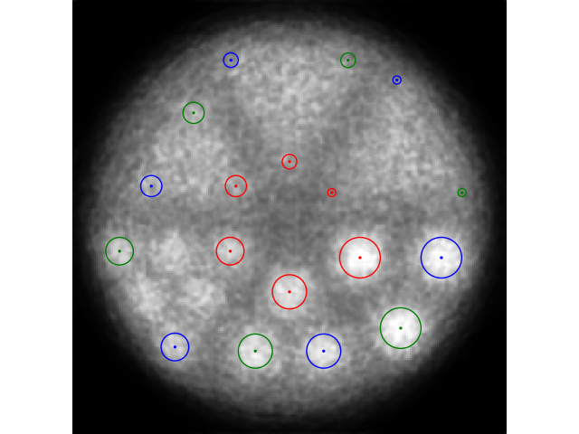
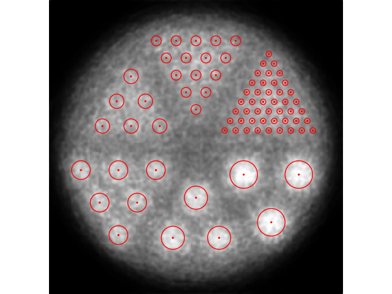
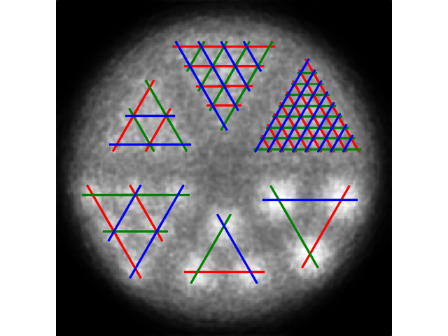
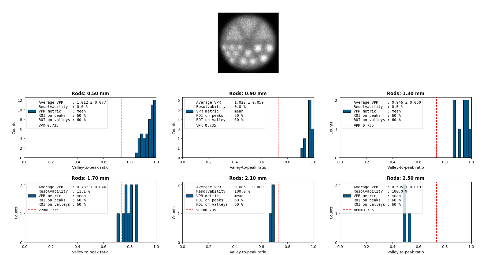

# Goal
Based on the suggestions in [1] for describing PET spatial resolution, this script evaluate the valley-to-peak ratio of the sectors of a Hot Spot phantom and defines the resolvability of a sector using the Rayleigh Criterion.

[1] Hallen, P., Schug, D. & Schulz, V. "*Comments on the NEMA NU 4-2008 Standard on Performance Measurement of Small Animal Positron Emission Tomographs.*", EJNMMI Phys. 7, 12 (2020). https://doi.org/10.1186/s40658-020-0279-2

# Implementation of resolvability
Here, resolvability is defined as the percent of valid pairs of spots in a sector that respect the Rayleigh Criterion. A valid pair of spots is defined as two spots in the sector that are distanced by a valley with the same width as the spots of that sector. This means that spots that are in the frontier of the sector are less sampled.

The evaluation of the Rayleigh Criterion for a pair of spots can be modulated in two ways. First, the user can define the portion of the region of interest to consider for the valley and for the peaks. Second, the user can use three metrics: minimum of the valley vs mean of the maximum of the peaks, mean of the valley vs mean of the peaks and mean of the valley vs maximum of the valley.   

# How to use

## tl;dr: an example
~~~
python3 computeDerenzoValleyToPeak.py \
	-f example/recon_step10_0_500.npy --npy3DIsStackOfIter --nSpacing 0.1042 0.1042 \
	-c example/config.json -m mean -r 0.3 0.3 \
	--showTriangPos --showSpotsPos  --showLinesProfile --imageShown 2 \
	--showVprHistos 
~~~
- Second line: Read a stack of 2D images saved as a 3D numpy array. Since numpy array do not save the size of the voxels in $(x, y)$, it is provided with `--nSpacing`
- Third line: The information needed to define the valley-to-peak ratio.
- Fourth line: Options for sanity checking the previous line. 
- Fifth line: Let the results be printed in the terminal and show histograms of each sector for every 2D images.

## Step-by-step with (too?) many words
Orientation and dimensions order are different among the images format. For this reason, we have provided some basic tools to describe the sectors in the system used in this script.

### Create the template for the configuration file
First, the argument `--genJsonExample` can be used to generate the template of the configuration file, in the json format, which describes the sectors. Sectors are defined using three parameters: the size of its spots, its number of rows and the $(x, y)$ position of the center of the three spots that encompass the sector vertices. Only the spots included in the triangle formed by those three spots are considered in this script. If you include rows with missing spots, the resolvability will be inaccurate.

The following assume that your image format is supported by the script. See the section titled `Image format` if you are not sure.

### Validate the position of the triangle vertices 
While the first two parameters of the configuration file should be known by the user, the last one is dependent on the script internal orientation/order of the $(x, y)$ axes. Thus, it is often more straight forward to use the `--showTriangPos` option and mouse-over to get the values needed in the configuration file. In the following image, you can see the results of that option when the configuration file was correctly defined. The first position, show in red, should be the one nearest to the phantom center. The second position, shown in blue, should be the next vertex by going clockwise (relative to the sector center). The third position, shown in green, should be the final vertex again by going clockwise.

 

### Validate the configuration file
Assuming that the position of the triangle vertices is done, you can now use the option `--showTriangPos` to see where the spots are expected to be. The next image shows what to expect. If you have correctly done the first step and the red circle are wrongly placed, it could be due to the two others parameters of the configuration file.

 

### View the line profile that will be used
A last sanity check can be done using the `--showLinesProfile` options which will show where the line profile will be taken. 

 

# Output 
By default, the resolvability of each sector will be printed in the terminal. Here is an example of what to expect:
~~~
=== Results ===
Image             : recon_step10_0_500.npy, iteration 30 of 500
Z-slice(s)        : None
VPR metric        : mean
ROI on peaks      : 30%
ROI on valleys    : 30%
Rod size (mm)     : 2.500	2.100	1.700	1.300	0.900	0.500	
Average VPR       : 0.464	0.619	0.754	0.932	1.021	1.012	
Stdev VPR         : 0.023	0.017	0.038	0.082	0.064	0.086
Resolvability [%] : 100.0	100.0	22.2	0.0	0.0	0.0

---> In green if phantom section has an average VPR < 0.735, in red otherwise.
~~~

The average valley-to-peak ratio (VPR) can be written in a csv files using the `--saveResults` option. 

For a more in-depth description of the resolvability of each sector, you can use the `--showVprHistos` option which will show a histogram of resolvability per sector.

# Image format

## Dimensionality
Currently, this script only analyzes 2D images. If 3D images are provided, the user is expected to provide a range of z index to consider. The script then sums the 2D slices of the given range to create a 2D image to analyze. For the analysis of a single slice, you can put twice the z index in the -z argument, for instance `-z 128 128` will only select the slice 128.

## Format
The following formats are (at least partially) supported: dicom, dicom directory, binary (float32/float64) with or without header offset, CASToR and 2D/3D numpy. In all cases, the image spatial offset is ignored currently. 

The script can process multiple files with one command by providing multiple arguments to `-f`. This can be useful if one desire to analyze multiple iterations of a given reconstruction.
